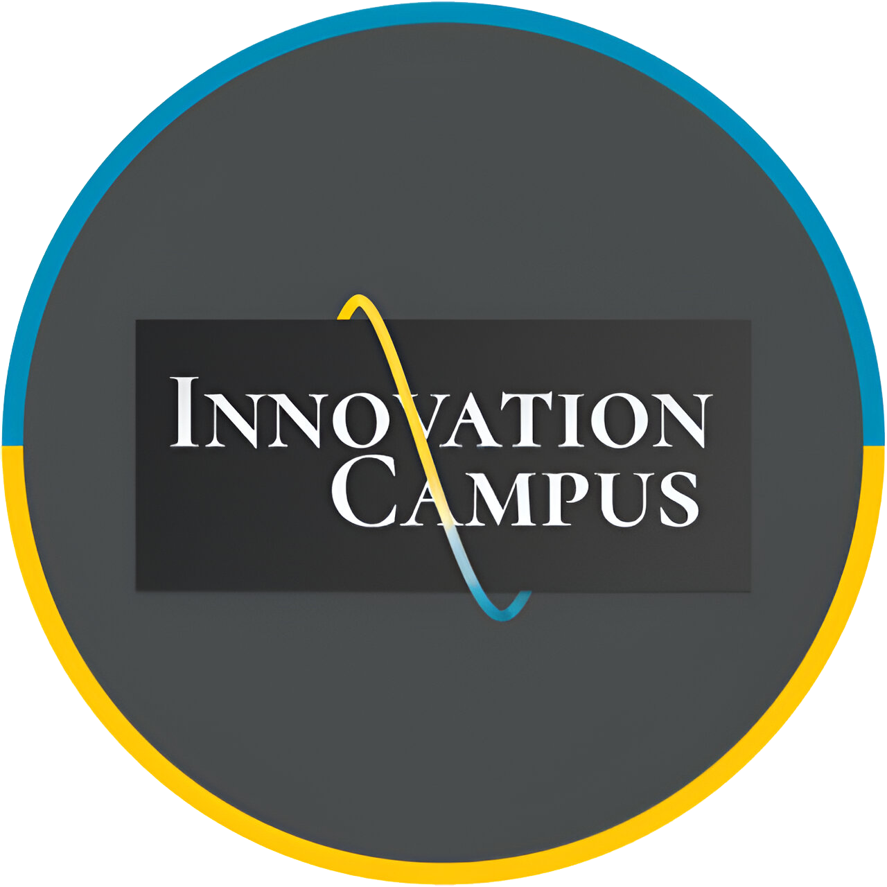

# Marathon C Repository

  
   
  <h2 align="center"><strong>Innovation Campus | Marathon C | 2023-2024</strong></h2>

  
Ukrainian

> ⚠️**УВАГА:**
>
> Цей матеріал публікується лише з інформаційною метою. Оцінки в таблиці результатів можуть бути неточними, оскільки деякі завдання, такі як Sprint00, Race03 і Race01, були переглянуті після відправлення або не були виконані і не могли бути повторно виконані, на відміну від спринтів. Також в функціях теж можуть бути наявні помилки.
>
> Якщо ви просто шукаєте результати, [натисніть тут](#Завдання).

---

  ### Вступ
  Привіт усім! 👋
  Ласкаво просимо до моєї подорожі з **Marathon C**, трансформаційною програмою, яка занурює вас у складний світ кодування. Цей досвід - це не просто навчання написанню коду; це сприяння глибокому розумінню комп'ютерних наук, оволодінню методами вирішення проблем та підготовка до майбутніх технологічних викликів. Це подорож, де наполегливість окупається, а кожна подолана перешкода сприяє твоєму зростанню як програміста.

  Як я зрозумів, освіта - це не просто сходинка, це життєво важлива частина самого життя. Якщо ви готові приступити до цього захоплюючого виклику, давайте зануримось у нього разом!

## Що таке Марафон С?

Марафон C - це інтенсивне вивчення основ програмування. Хоча шлях може бути складним, винагорода - міцний фундамент в інформатиці та готовність до роботи з передовими технологіями - безцінна. Філософія програми проста і водночас глибока: **«Освіта - це не просто підготовка до життя, це невід'ємна частина життя».**

  ### У чому полягає велика ідея?
  Основна ідея цього Марафону проста: знайди свій шлях до успіху.

  Основне питання, яке лежить в основі цього досвіду, полягає в наступному:
  Як ефективно використати всі компоненти освітньої системи, щоб отримати якомога більше досвіду?

  Сам виклик простий - почати вивчати програмування.

  ### Подорож
  Як ефективно використовувати всі компоненти освітньої системи, щоб отримати якомога більше досвіду?

### Виклик:
**Почніть вивчати програмування!**

---

## Досліджуємо

### Навідні запитання

Ось деякі з питань, які змусили мене замислитися і допомогли мені почати свою подорож. Можливо, вони допоможуть і вам:

- Хто я? Який мій досвід? Чому я хочу вивчати програмування?
- Які ідеї я можу втілити в життя за допомогою програмування?
- Які навички я хочу розвинути та які проекти хотів би створити?
- Що мені потрібно для початку? Чи готовий я зробити цей крок?

### Направляючі вправи

Ось як я крок за кроком вирішував цю задачу:

1. **Дізнався про операційні системи (ОС)** та встановив необхідні інструменти для роботи.
2. **Підключився до ucode connect** та дослідив середовище.
3. Відкрив утиліту **Terminal/iTerm**, щоб звикнути до інтерфейсу **командного рядка**.
4. Дослідив текстові редактори на кшталт **Vim** або **Emacs** (з Vim довелося довго розбиратися, особливо як вийти з нього 😅).
5. Подивився підручники та клонував свій перший Git-репозиторій за допомогою `git clone`.
6. Співпрацював з колегами, обмінюючись знаннями та досвідом.

---

## Аналіз

Ось чого я навчився:

- Завжди ретельно аналізуйте приклади, деталі мають значення.
- Дотримуйтесь завдань, викладених у завданні - ніяких обхідних шляхів чи зайвих деталей.
- Дотримуйтесь інструкцій щодо подання роботи - тримайте її чистою та структурованою.
- Використовуйте такі інструменти, як термінал або iTerm з командою `zsh`.
- Навчання за принципом «рівний-рівному» - це фантастика, а прохання про допомогу - ознака сили.
- Нарешті, **мисліть критично і йдіть за білим кроликом**.

---

  ## Використані технології
  

      <b>Мови програмування:</b>
  

    
    
  

  

      <b>Обладнання:</b>
  

    
    
    
    
    
    
  

  

      <b>Операційна система:</b>
  

    
    
    
  

  ## <h2 id="Завдання">Завдання</h2>

| Name         | Description                                                                 | Oracle Mark | Total Mark |
|--------------|-----------------------------------------------------------------------------|:-----------:|:----------:|
| [Sprint00](./Sprint00)     | Основи UNIX-систем (shell, термінал, утиліти UNIX, git тощо).    |     65      |     82     |
| [Sprint01](./Sprint01)     | Основи написання коду на C (цикли, змінні, функції тощо).        |     40      |     70     |
| [Sprint02](./Sprint02)     | Стандартні функції та основи реалізації математики в мові C.      |     94      |     97     |
| [Sprint03](./Sprint03)     | Покажчики в мові C та більш складні алгоритми.                                 |     80      |     90     |
| [Checkpoint00](./Checkpoint00) | Випробуйте себе без інтернету, однолітків, конспектів, книжок чи будь-якої іншої сторонньої допомоги. |    102      |    102     |
| [Race00](./Race00)       | Представлення 3D куба та піраміди на стандартному виводі.              |    100      |    100     |
| [Sprint04](./Sprint04)     | Масиви та похідні від них.                                           |     76      |     88     |
| [Sprint05](./Sprint05)     | Прості програми та аргументи командного рядка.                                |     35      |     68     |
| [Sprint06](./Sprint06)     | Власна бібліотека та алгоритми сортування.                                        |     69      |     85     |
| [Sprint07](./Sprint07)     | Розподіл та управління пам'яттю.                                   |     58      |     79     |
| [Sprint08](./Sprint08)     | Заголовкові файли та структури.                                               |     88      |     94     |
| [Checkpoint01](./Checkpoint01) | Випробуйте себе без інтернету, однолітків, конспектів, книжок чи будь-якої іншої сторонньої допомоги. |    115      |    115     |
| [Sprint09](./Sprint09)     | Makefile, макроси, стандартна помилка, покажчики функцій.                       |     52      |     76     |
| [Race01](./Race01)       | Розшифруйте зашифрований математичний вираз.                                          |      0      |      0     |
| [Sprint10](./Sprint10)     | Файловий ввід/вивід. Стандартний ввід та вивід.                                       |     40      |     70     |
| [Sprint11](./Sprint11)     | Зв'язний список.                                                               |     65      |     82     |
| [Race02](./Race02)       | Знайти найкоротший шлях у лабіринті між точками входу та виходу.      |     94      |     97     |
| [Race03](./Race03)       | Імітація заставки «Матриці».                                           |      0      |      0     |
| [Checkpoint02](./Checkpoint02) | Випробуйте себе без інтернету, однолітків, конспектів, книжок чи будь-якої іншої сторонньої допомоги. |     68      |     68     |

---

## Мої враження

Я працював над Марафоном С протягом січня та лютого 2024 року, і це був незабутній досвід для мене. Ця подорож - це поєднання рішучості, знань та співпраці. Якщо ви студент інноваційного кампусу, я наполегливо рекомендую вам зануритися у цю подорож - виклики будуть випробуванням для вас, але знання та навички, які ви отримаєте, будуть того варті.

Давайте програмувати наш шлях до успіху!

  
 English

> ⚠️**CAUTION:**
>
> This material is published for informational purposes only. The grades in the results table may not be accurate, as some tasks such as Sprint00, Race03, and Race01 were revised after submission or failed and could not be retried, unlike sprints. There can also be errors in the functions.
>
> If you’re just looking for results, [click here](#tasks).

---

  ### Introduction
  Hey everyone! 👋
  Welcome to my journey with **Marathon C**, a transformative program that immerses you in the intricate world of coding. This experience is not merely about learning to write code; it’s about fostering a deep understanding of computer science, mastering problem-solving, and preparing for future technological challenges. It’s a journey where persistence pays off, and every hurdle overcome adds to your growth as a programmer.

  As I’ve learned, education is not just a stepping stone — it’s a vital part of life itself. If you’re eager to embark on this exciting challenge, let’s dive in together!

## What’s Marathon C?

Marathon C is an intensive exploration of programming fundamentals. While the path may be challenging, the rewards — a strong foundation in computer science and readiness to tackle advanced technologies — are invaluable. The program’s philosophy is simple yet profound: **«education is not merely preparation for life, it’s an indispensable part of living.»**

  ### What’s the Big Idea?
  The core idea of this Marathon is simple: find your way to success.

  The essential question that drives the experience is:
  How can you effectively use all the components of an educational system to gain as much experience as possible?

  The challenge itself is straightforward — start learning programming.

  ### The Journey
  How to effectively use all the components of the educational system to get as much experience as possible?

### The Challenge:
**Start learning programming!**

---

## Let’s Investigate

### Guiding Questions

These are some of the questions that got me thinking and helped me start my journey. Maybe they’ll help you too:

- Who am I? What’s my background? Why do I want to learn programming?
- What ideas can I bring to life with programming?
- What skills do I want to develop, and what projects would I love to create?
- What do I need to get started? Am I ready to take the leap?

### Guiding Activities

Here’s how I tackled the challenge step by step:

1. **Learned about operating systems (OS)** and set up the tools I needed.
2. **Connected to the ucode connect** and explored the environment.
3. Opened the **Terminal/iTerm** utility to get comfortable with the **command-line interface**.
4. Explored the text editors like **Vim** or **Emacs** (it took a while to figure out how to exit Vim 😅).
5. Watched tutorials and cloned my first Git repository with `git clone`.
6. Collaborated with peers, sharing knowledge and experiences.

---

## The Analysis

Here’s what I learned:

- Always analyze examples carefully, the details matter.
- Stick to the tasks outlined in the challenge – no shortcuts or extra fluff.
- Follow the guidelines for submission – keep it clean and structured.
- Use tools like the Terminal or iTerm with `zsh`.
- Peer-to-peer learning is fantastic, and asking for help is a sign of strength.
- Finally, **think critically and follow the white rabbit.**

---

  ## Technologies Used
  

      <b>Programming Languages:</b>
  

    
    
  

  

      <b>Tools:</b>
  

    
    
    
    
    
    
  

  

      <b>Operating System:</b>
  

    
    
    
  

  ## Tasks

| Name         | Description                                                                 | Oracle Mark | Total Mark |
|--------------|-----------------------------------------------------------------------------|:-----------:|:----------:|
| [Sprint00](./Sprint00)     | The basics of UNIX systems (shell, terminal, UNIX utilities, git, etc).    |     65      |     82     |
| [Sprint01](./Sprint01)     | The basics of writing code in C (loops, variables, functions, etc).        |     40      |     70     |
| [Sprint02](./Sprint02)     | Standard functions and the basics of mathematics implementation in C.      |     94      |     97     |
| [Sprint03](./Sprint03)     | Pointers in C and more complex algorithms.                                 |     80      |     90     |
| [Checkpoint00](./Checkpoint00) | Challenge yourself without internet, peers, notes, books or any other third-party help. |    102      |    102     |
| [Race00](./Race00)       | Representation of 3d cube and pyramid on the standard output.              |    100      |    100     |
| [Sprint04](./Sprint04)     | Arrays and derivative from them.                                           |     76      |     88     |
| [Sprint05](./Sprint05)     | Simple programs and command-line arguments.                                |     35      |     68     |
| [Sprint06](./Sprint06)     | Own library and sorting algorithms.                                        |     69      |     85     |
| [Sprint07](./Sprint07)     | Memory allocation and memory management.                                   |     58      |     79     |
| [Sprint08](./Sprint08)     | Header files and structures.                                               |     88      |     94     |
| [Checkpoint01](./Checkpoint01) | Challenge yourself without internet, peers, notes, books or any other third-party help. |    115      |    115     |
| [Sprint09](./Sprint09)     | Makefile, macros, standard error, function pointers.                       |     52      |     76     |
| [Race01](./Race01)       | Decode encrypted math expression.                                          |      0      |      0     |
| [Sprint10](./Sprint10)     | File I/O. Standard input and output.                                       |     40      |     70     |
| [Sprint11](./Sprint11)     | Linked list.                                                               |     65      |     82     |
| [Race02](./Race02)       | Find the shortest path in the maze between the entry and exit points.      |     94      |     97     |
| [Race03](./Race03)       | Simulate the Matrix screensaver.                                           |      0      |      0     |
| [Checkpoint02](./Checkpoint02) | Challenge yourself without internet, peers, notes, books or any other third-party help. |     68      |     68     |

---

## My Takeaway

I worked on Marathon C throughout January and February 2024, and it’s been an unforgettable experience. This journey is a blend of determination, knowledge, and collaboration. If you’re a student of Innovation Campus, I highly recommend diving in – the challenges will test you, but the skills you gain are worth it.

Let’s code our way to success!

  
Germany

  
> ⚠️ **WARNUNG:**
>
> Dieses Material wird nur zu Informationszwecken veröffentlicht. Die Punktzahlen in der Ergebnistabelle können ungenau sein, da einige Aufgaben, wie Sprint00, Race03 und Race01, nach der Einreichung überarbeitet wurden oder nicht abgeschlossen wurden und im Gegensatz zu Sprints nicht wiederholt werden konnten. Es können auch Fehler in den Funktionen enthalten sein.
>
> Wenn Sie nur nach Ergebnissen suchen, [klicken Sie hier](#Aufgaben).

---

  ### Einleitung
  Hallo zusammen 👋.
  Willkommen auf meiner Reise mit **Marathon C**, einem transformativen Programm, das Sie in die komplexe Welt des Programmierens eintauchen lässt. Bei dieser Erfahrung geht es um mehr als nur darum, das Schreiben von Code zu lernen; es geht darum, ein tiefes Verständnis der Informatik zu fördern, Problemlösungstechniken zu beherrschen und sich auf zukünftige technologische Herausforderungen vorzubereiten. Es ist eine Reise, bei der sich Beharrlichkeit auszahlt und jedes Hindernis, das man überwindet, dazu beiträgt, dass man als Programmierer wächst.

  Ich habe gelernt, dass Bildung nicht nur ein Sprungbrett ist, sondern ein wichtiger Teil des Lebens selbst. Wenn Sie bereit sind, sich dieser spannenden Herausforderung zu stellen, lassen Sie uns gemeinsam eintauchen!

## Was ist Marathon C?

Der C-Marathon ist ein intensives Studium der Programmiergrundlagen. Auch wenn der Weg dorthin herausfordernd sein kann, sind die Belohnungen - eine solide Grundlage in Informatik und die Bereitschaft, mit Spitzentechnologien zu arbeiten - unbezahlbar. Die Philosophie des Programms ist einfach und doch tiefgründig: **«Bildung ist nicht nur eine Vorbereitung auf das Leben, sie ist ein integraler Bestandteil des Lebens.»**

  ### Was ist die große Idee?
  Der Grundgedanke dieses Marathons ist einfach: Finde deinen Weg zum Erfolg.

  Die Hauptfrage, die dieser Erfahrung zugrunde liegt, ist die folgende:
  Wie kann man alle Komponenten des Bildungssystems effektiv nutzen, um so viele Erfahrungen wie möglich zu sammeln?

  Die Herausforderung selbst ist einfach - fangen Sie an, programmieren zu lernen.

  ### Reise
  Wie kann man alle Komponenten des Bildungssystems effektiv nutzen, um so viel Erfahrung wie möglich zu sammeln?

### Die Herausforderung:
**Beginnen Sie zu programmieren!**

---

## Erkunden.

### Leitende Fragen

Hier sind einige der Fragen, die mich zum Nachdenken gebracht und mir geholfen haben, meine Reise zu beginnen. Vielleicht helfen sie auch Ihnen:

- Wer bin ich? Welche Erfahrungen habe ich? Warum möchte ich programmieren lernen?
- Welche Ideen kann ich mit dem Programmieren verwirklichen?
- Welche Fähigkeiten möchte ich entwickeln und welche Projekte würde ich gerne realisieren?
- Was brauche ich, um anzufangen? Bin ich bereit, diesen Schritt zu tun?

### Leitende Übungen

So habe ich dieses Problem Schritt für Schritt gelöst:

1) **Betriebssysteme (OS)** kennengelernt und die Tools installiert, die ich für den Einstieg brauchte.
2. Verbinden Sie sich mit ucode connect** und erkunden Sie die Umgebung.
3. Ich öffnete das Dienstprogramm **Terminal/iTerm**, um mich an die **Befehlszeilenschnittstelle** zu gewöhnen.
4. Ich erkundete Texteditoren wie **Vim** oder **Emacs** (ich brauchte lange, um herauszufinden, wie man Vim beendet, vor allem, wie man ihn beendet 😅).
5. Ich habe mir Tutorials angesehen und mein erstes Git-Repository mit `git clone` geklont.
6. Ich habe mit Kollegen zusammengearbeitet und Wissen und Erfahrungen ausgetauscht.

---

## Analyse

Das habe ich gelernt:

- Analysieren Sie die Beispiele immer gründlich, auf die Details kommt es an.
- Halten Sie sich an die in der Aufgabenstellung beschriebenen Aufgaben - keine Umgehungslösungen oder unnötige Details.
- Befolgen Sie die Anweisungen für die Abgabe Ihrer Arbeit - halten Sie sie sauber und strukturiert.
- Verwenden Sie Tools wie ein Terminal oder iTerm mit dem Befehl `zsh'.
- Peer-to-Peer-Lernen ist fantastisch, und um Hilfe zu bitten ist ein Zeichen von Stärke.
- Und schließlich: **Denken Sie kritisch und folgen Sie dem weißen Kaninchen**.

---

  ## Verwendete Technologien
  

      <b>Programmiersprachen:</b>
  

    
    
  

  

      <b>Werkzeuge:</b>
  

    
    
    
    
    
    
  

  

      <b>Betriebssystem:</b>
  

    
    
    
  

---

  ## <h2 id="Aufgaben">Aufgaben</h2>

| Name         | Description                                                                 | Oracle Mark | Total Mark |
|--------------|-----------------------------------------------------------------------------|:-----------:|:----------:|
| [Sprint00](./Sprint00)     | Grundlagen von UNIX-Systemen (Shell, Terminal, UNIX-Dienstprogramme, git, usw.).    |     65      |     82     |
| [Sprint01](./Sprint01)     | Die Grundlagen des Schreibens von C-Code (Schleifen, Variablen, Funktionen, usw.).        |     40      |     70     |
| [Sprint02](./Sprint02)     | Standardfunktionen und Grundlagen der Implementierung von Mathematik in C.      |     94      |     97     |
| [Sprint03](./Sprint03)     | C Zeiger und komplexere Algorithmen.                                 |     80      |     90     |
| [Checkpoint00](./Checkpoint00) | Testen Sie sich selbst, ohne Internet, Mitschüler, Notizen, Bücher oder andere Hilfe von außen. |    102      |    102     |
| [Race00](./Race00)       | Repräsentation eines 3D-Würfels und einer Pyramide auf einer Standardausgabe.              |    100      |    100     |
| [Sprint04](./Sprint04)     | Arrays und ihre Ableitungen.                                           |     76      |     88     |
| [Sprint05](./Sprint05)     | Einfache Programme und Befehlszeilenargumente.                                |     35      |     68     |
| [Sprint06](./Sprint06)     | Eigene Bibliothek und Sortieralgorithmen.                                        |     69      |     85     |
| [Sprint07](./Sprint07)     | Speicherzuordnung und -verwaltung.                                   |     58      |     79     |
| [Sprint08](./Sprint08)     | Headerdateien und Strukturen.                                               |     88      |     94     |
| [Checkpoint01](./Checkpoint01) | Testen Sie sich selbst, ohne Internet, Mitschüler, Notizen, Bücher oder andere Hilfe von außen. |    115      |    115     |
| [Sprint09](./Sprint09)     | Makefile, Makros, Standardfehler, Funktionszeiger.                       |     52      |     76     |
| [Race01](./Race01)       | Entschlüsseln Sie den verschlüsselten mathematischen Ausdruck.                                          |      0      |      0     |
| [Sprint10](./Sprint10)     | Datei-E/A. Standard-Eingabe und -Ausgabe.                                       |     40      |     70     |
| [Sprint11](./Sprint11)     | Verknüpfte Liste.                                                               |     65      |     82     |
| [Race02](./Race02)       | Finde den kürzesten Weg im Labyrinth zwischen dem Eingangs- und dem Ausgangspunkt.      |     94      |     97     |
| [Race03](./Race03)       | Nachahmung des Matrix-Startbildschirms.                                           |      0      |      0     |
| [Checkpoint02](./Checkpoint02) | Testen Sie sich selbst, ohne Internet, Mitschüler, Notizen, Bücher oder andere Hilfe von außen. |     68      |     68     |

---

## Meine Eindrücke

Ich habe im Januar und Februar 2024 an Marathon C gearbeitet und es war eine unvergessliche Erfahrung für mich. Diese Reise ist eine Kombination aus Entschlossenheit, Wissen und Zusammenarbeit. Wenn Sie ein Student des Innovation Campus sind, empfehle ich Ihnen, sich auf diese Reise einzulassen - die Herausforderungen werden Sie auf die Probe stellen, aber das Wissen und die Fähigkeiten, die Sie erwerben werden, sind es wert.

Wir werden uns den Weg zum Erfolg programmieren!
  

